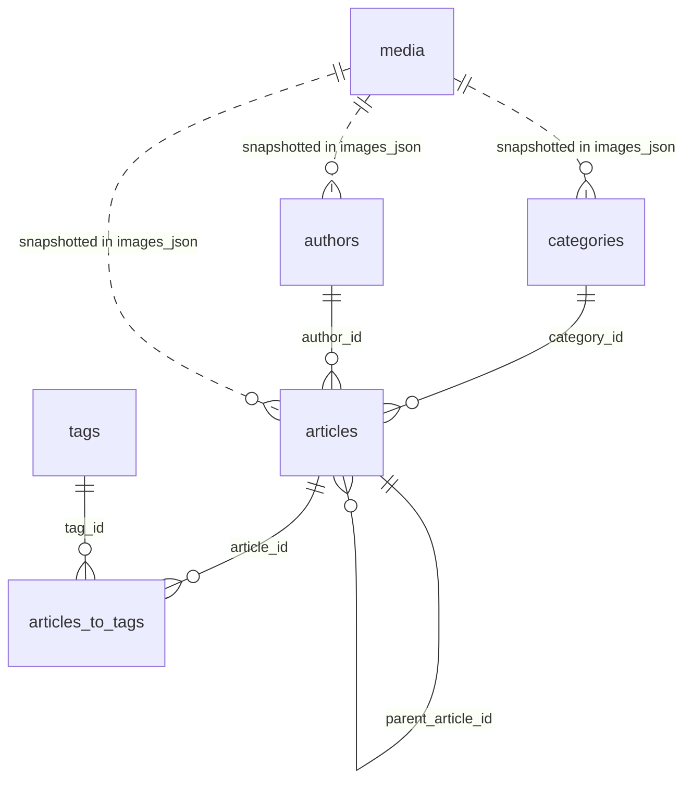

# Database Content Model

> **Last Updated:** 2026-04-29

This document describes the CMS/blog database model at a product and architecture level. The SQL source of truth remains `db/schema.sql`.

## Responsibility Split

- `db/schema.sql`: executable database structure, indexes, triggers, and short SQL comments.
- `docs/DATABASE_CONTENT_MODEL.md`: table relationships and data ownership.
- `docs/ARTICLE_TABLE_CONTRACT.md`: complete `articles` table contract.
- `docs/ARTICLE_CACHED_FIELDS_CONTRACT.md`: cached field contracts for `articles`.
- `docs/ARTICLE_JSON_CONTRACTS.md`: JSON fields stored on `articles`, except `content_json`.
- `docs/CONTENT_JSON_CONTRACT.md`: only `articles.content_json`.
- `docs/RECIPE_JSON_CONTRACT.md`: only `articles.recipe_json`.
- `docs/MEDIA_TABLE_CONTRACT.md`: complete `media` table contract.
- `docs/MEDIA_IMAGE_CONTRACT.md`: media variants, image slots, and public/private image rules.
- `docs/CATEGORIES_TABLE_CONTRACT.md`: complete `categories` table contract.
- `docs/AUTHORS_TABLE_CONTRACT.md`: complete `authors` table contract.
- `docs/TAGS_TABLE_CONTRACT.md`: complete `tags` and `articles_to_tags` contract.
- `docs/SITE_SETTINGS_TABLE_CONTRACT.md`: complete `site_settings` table contract.
- `docs/EQUIPMENT_TABLE_CONTRACT.md`: complete `equipment` table contract.
- `docs/REDIRECTS_TABLE_CONTRACT.md`: complete `redirects` table contract.

## Relationship Model

`media` is the asset source, but public rendering normally uses image snapshots copied into JSON fields. This avoids runtime joins for common article, category, author, and related-content views.

## Table Roles

### `articles`

Central content table for `article`, `recipe`, and `roundup`.

Source fields:

- identity and routing: `id`, `slug`, `type`, `locale`
- relationships: `category_id`, `author_id`, `parent_article_id`
- editorial metadata: `headline`, `subtitle`, `short_description`, `excerpt`, `introduction`
- source JSON: `images_json`, `content_json`, `recipe_json`, `roundup_json`, `seo_json`, `config_json`

Derived/cache fields:

- SEO/content caches: `faqs_json`, `jsonld_json`, `cached_toc_json`
- listing/render caches: `cached_tags_json`, `cached_category_json`, `cached_author_json`, `cached_equipment_json`, `cached_rating_json`, `cached_recipe_json`, `cached_card_json`
- indexed scalar mirrors: `reading_time_minutes`, `total_time_minutes`, `difficulty_label`

Workflow/system:

- `workflow_status`, `scheduled_at`, `is_online`, `is_favorite`, `access_level`, `view_count`, `published_at`, `deleted_at`

### `media`

Central asset library and R2 metadata.

Important fields:

- searchable metadata: `name`, `alt_text`, `caption`, `credit`, `mime_type`
- image behavior: `aspect_ratio`, `focal_point_json`
- storage payload: `variants_json`
- lifecycle: `created_at`, `updated_at`, `deleted_at`

Rule: `media.variants_json` is the complete asset source of truth and stores all generated variants with `r2_key`. Public JSON must not expose `r2_key`.

### `categories`

Primary taxonomy and navigation hierarchy.

Contract: `docs/CATEGORIES_TABLE_CONTRACT.md`.

Important fields:

- routing/hierarchy: `slug`, `label`, `parent_id`, `depth`
- page content: `headline`, `collection_title`, `short_description`
- visuals: `images_json`, `color`, `icon_svg`
- configuration: `seo_json`, `config_json`, `i18n_json`
- cache/lifecycle: `cached_post_count`, `is_online`, `deleted_at`

`articles.category_id` is required and uses `ON DELETE RESTRICT`.

### `authors`

Attribution, public profiles, and admin identity metadata.

Contract: `docs/AUTHORS_TABLE_CONTRACT.md`.

Important fields:

- identity: `slug`, `name`, `email`
- public profile: `job_title`, `headline`, `subtitle`, `short_description`, `excerpt`, `introduction`
- visuals/social/SEO: `images_json`, `bio_json`, `seo_json`
- workflow/cache: `role`, `is_online`, `is_featured`, `cached_post_count`, `deleted_at`

`articles.author_id` is required and uses `ON DELETE RESTRICT`.

### `tags` and `articles_to_tags`

`tags` are secondary taxonomy/filter labels.

Contract: `docs/TAGS_TABLE_CONTRACT.md`.

Important tag fields:

- `slug`, `label`, `description`
- `filter_groups_json`
- `style_json`
- `cached_post_count`
- `deleted_at`

`articles_to_tags` is the source of truth for article/tag membership. `articles.cached_tags_json` is only a display/search snapshot with minimal tag objects.

### `site_settings`

Global key-value configuration registry.

Contract: `docs/SITE_SETTINGS_TABLE_CONTRACT.md`.

Important fields:

- `key`
- `value`
- `description`
- `category`
- `sort_order`
- `type`
- `updated_at`

Known setting domains include image upload settings, TOC settings, menus, and AI/provider configuration paths. The table does not have `is_public`, `created_at`, or `deleted_at` columns.

### `equipment`

Admin-managed kitchen equipment catalog with affiliate metadata.

Contract: `docs/EQUIPMENT_TABLE_CONTRACT.md`.

Important fields:

- identity: `id`, `slug`, `name`, `brand`
- matching/filtering: `keywords`, `category`
- product display: `description`, `image_json`, `price_display`
- affiliate: `affiliate_url`, `affiliate_provider`, `affiliate_note`
- workflow/lifecycle: `is_active`, `sort_order`, `deleted_at`

`recipe_json.equipment` remains the complete recipe equipment checklist. `equipment` rows only provide rich product/affiliate cards for matching active tools.

### `redirects`

SEO redirect rules and hit tracking.

Contract: `docs/REDIRECTS_TABLE_CONTRACT.md`.

Important fields:

- routing: `from_path`, `to_path`, `status_code`, `is_active`
- internal notes: `notes`
- runtime stats: `hit_count`, `last_hit_at`

This table has no `deleted_at`; pause with `is_active = 0` when history should be kept.

## Runtime Usage

### Admin / BlockEditor

The admin editor loads:

- lookup data from `categories`, `authors`, and `tags`
- article source JSON fields: `contentJson`, `recipeJson`, `roundupJson`, `imagesJson`
- selected tags, saved through the API into `articles_to_tags`
- media records through media pickers, then copies image slots into JSON snapshots

The BlockEditor owns `contentJson` editing only. Recipe data, article images, SEO/config, and tags are adjacent article editing concerns.

### Public Astro Frontend

Public pages read articles through module services, then render:

- `contentJson` through `ContentRenderer.astro`
- `recipeJson` in full recipe layouts/components
- `imagesJson` for hero, thumbnail, and content imagery
- hydrated author/category snapshots
- list/filter pages through `getArticles`

The full recipe card renderer reads `recipe_json`. Recipe lists, roundup items, related content, and filters should prefer `cached_recipe_json` and other snapshots to avoid avoidable D1 reads and full recipe parsing.

## Database Automation

Article lifecycle triggers:

- `trg_articles_updated_at`: updates `updated_at`
- `trg_articles_set_published_at`: sets first publish timestamp
- `trg_articles_online_workflow`: syncs online articles to `published`
- `trg_articles_prevent_delete`: converts hard delete into soft delete

Search triggers:

- maintain `idx_articles_search`
- extract body text from `content_json.blocks`
- extract recipe ingredient names from `recipe_json`
- include cached tag, author, and category labels

Category count triggers:

- update `categories.cached_post_count` for online, non-deleted articles

Application-managed cache refresh:

- `cached_equipment_json` is regenerated by application/service logic when a recipe saves or when linked equipment metadata changes.
- SQL triggers should not rebuild rich equipment JSON because the payload depends on recipe-specific fields, active equipment rows, affiliate metadata, and image normalization.

Known gap:

- `tags.cached_post_count` is documented, but no equivalent tag-count trigger is visible in `schema.sql`.

## Contract Direction

- Keep relational identity in SQL: article/category/author/tag IDs are source of truth.
- Keep flexible body data in `content_json` and complete structured recipe data in `recipe_json`.
- Keep public rendering fast with cache/snapshot JSON.
- Never expose storage-only fields such as `r2_key` in public API or frontend contracts.
- Keep detailed JSON examples out of `schema.sql`; put them in the dedicated docs.
