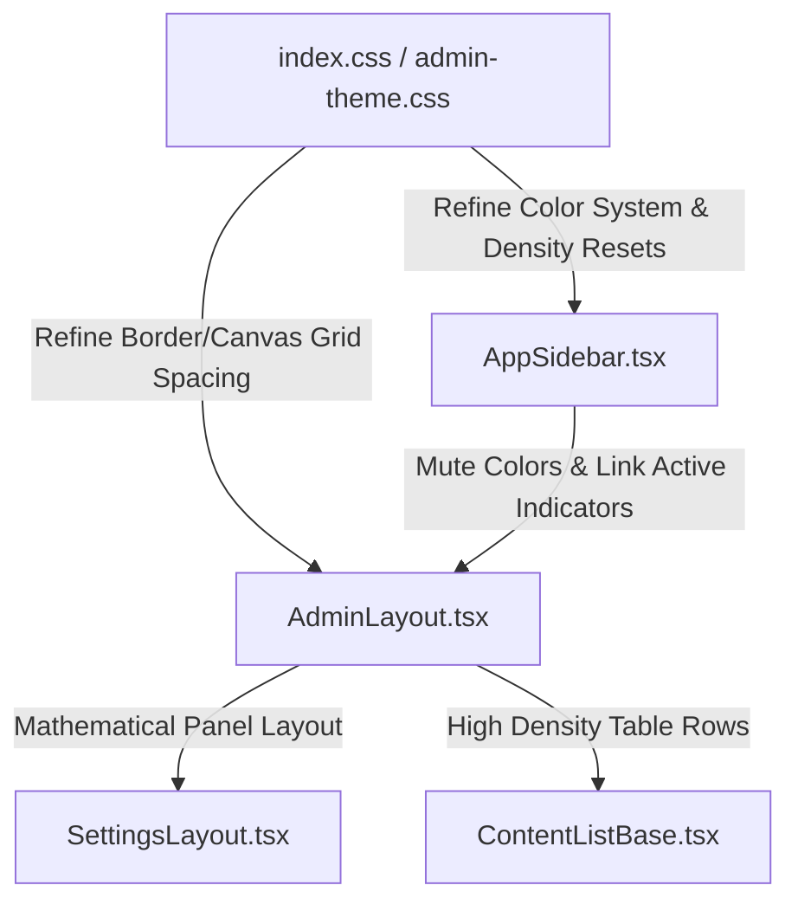

# Crisp Gutenberg 2-Panel Admin UI Redesign Implementation Plan

> **For agentic workers:** REQUIRED SUB-SKILL: Use superpowers:subagent-driven-development (recommended) or superpowers:executing-plans to implement this plan task-by-task. Steps use checkbox (`- [ ]`) syntax for tracking.

**Goal:** Redesign the React 19 Admin SPA panel in the SaaS Blog CMS (excluding the template editor) to achieve a high-density, dual-rail, zero-padding canvas, and mathematical grid spacing with muted accent states.

**Architecture:** Mute the colorful sidebar icons into a unified slate tint that dynamically transitions to the HSL primary accent blue (`#2563eb`) on active and hover states. Restructure `AdminLayout`, `AppSidebar`, and `SettingsLayout` to embrace Gutenberg panel dynamics with mathematical spacing, replacing ad-hoc style classes with exact HSL design tokens.

**Tech Stack:** Astro 6.3.3, React 19, Tailwind CSS v4, Radix/shadcn, Lucide React

---

## Proposed Changes



### Component Mapping & Responsibilities
1. **`src/admin/styles/admin-theme.css`**: Defines unified CSS variables for light/dark modes. Re-calibrates active/muted borders and focus ring colors to prevent "rainbow" visual clutter.
2. **`src/admin/components/AppSidebar.tsx`**: Eliminates legacy colorful styling mappings for icon buttons, converting them to neutral slate icons transitioning smoothly to `--primary` on hover/active.
3. **`src/admin/components/AdminLayout.tsx`**: Embeds high-density panel rules, standardizing headers, alignments, and padding canvas to zero-padding boundaries.
4. **`src/admin/features/settings/components/SettingsLayout.tsx`**: Standardizes the 2-panel settings explorer to match the primary admin layout grid structures.
5. **`src/admin/components/shared/ContentListBase.tsx`**: Sharpens table rows, cards, stats grids, and pagination to the mathematical visual standard.

---

## Tasks

### Task 1: Refine CSS Variables and Global Density Overrides

**Files:**
- Modify: `src/admin/styles/admin-theme.css`
- Modify: `src/admin/index.css`

- [ ] **Step 1: Simplify admin-theme active states and shadow systems**
  Update the HSL colors inside `src/admin/styles/admin-theme.css` to define strict borders and mute the shadow levels for high-density grids.

  Modify `src/admin/styles/admin-theme.css` lines 33-43:
  ```css
      --border: #e2e8f0;
      --border-strong: #cbd5e1;
      --border-subtle: #f8fafc;

      --shadow-color: 15 23 42;
      --shadow-sm: 0 1px 2px rgba(var(--shadow-color), 0.03);
      --shadow-md: 0 2px 8px rgba(var(--shadow-color), 0.05);
      --shadow-lg: 0 8px 20px rgba(var(--shadow-color), 0.06);
      --shadow-xl: 0 12px 30px rgba(var(--shadow-color), 0.08);
      --shadow-hover: 0 4px 16px rgba(var(--shadow-color), 0.07);
      --shadow-focus: 0 0 0 2px rgba(37, 99, 235, 0.15);
  ```

  And update the dark mode shadows in `src/admin/styles/admin-theme.css` lines 98-104:
  ```css
      --border: #1e293b;
      --border-strong: #334155;
      --border-subtle: #090d16;

      --shadow-color: 2 6 23;
      --shadow-sm: 0 1px 2px rgba(var(--shadow-color), 0.15);
      --shadow-md: 0 2px 8px rgba(var(--shadow-color), 0.2);
      --shadow-lg: 0 8px 20px rgba(var(--shadow-color), 0.25);
      --shadow-xl: 0 12px 30px rgba(var(--shadow-color), 0.3);
      --shadow-hover: 0 4px 16px rgba(var(--shadow-color), 0.25);
      --shadow-focus: 0 0 0 2px rgba(96, 165, 250, 0.28);
  ```

- [ ] **Step 2: Add high-density table and border utility classes in index.css**
  Inject a custom global class in `src/admin/index.css` to refine layout borders, high-density cards, and smooth transitions on hover.

  Modify `src/admin/index.css` lines 73-76:
  ```css
  [data-surface="admin"] * {
    border-color: hsl(var(--border));
    transition-property: color, background-color, border-color;
    transition-duration: 150ms;
    transition-timing-function: cubic-bezier(0.4, 0, 0.2, 1);
  }
  ```

  Add high density table spacing settings around line 131 in `src/admin/index.css`:
  ```css
  [data-surface="admin"] th {
    color: hsl(var(--muted-foreground));
    font-size: 0.75rem;
    text-transform: uppercase;
    letter-spacing: 0.05em;
    font-weight: 600;
    padding: 0.5rem 0.75rem !important;
    border-bottom: 1px solid hsl(var(--border));
  }

  [data-surface="admin"] td {
    vertical-align: middle;
    padding: 0.5rem 0.75rem !important;
    font-size: 0.8125rem;
    border-bottom: 1px solid hsl(var(--border) / 0.5);
  }
  ```

---

### Task 2: Refactor AppSidebar to Mute Icon Clutter

**Files:**
- Modify: `src/admin/components/AppSidebar.tsx`

- [ ] **Step 1: Delete individual color mappings and simplify menu item rendering**
  Open `src/admin/components/AppSidebar.tsx`. We will completely remove the colorful mapping dictionary (`itemStyles`) and replace it with a unified `text-muted-foreground/80 group-hover/menu-button:text-primary group-data-[active=true]/menu-button:text-primary` class.

  Replace `itemStyles` dictionary (lines 64-80) with a single string variable or completely inline it. Let's make it inline and clean up the references.

  Modify `src/admin/components/AppSidebar.tsx` to remove:
  ```typescript
  const itemStyles: Record<string, string> = {
    Dashboard: "text-blue-600",
    ...
  };
  ```

  And change the icon injection in:
  - Simple items (lines 218):
    ```typescript
    <item.icon className="size-4 text-muted-foreground/80 transition-colors group-hover/menu-button:text-primary group-data-[active=true]/menu-button:text-primary" />
    ```
  - Direct links (lines 237):
    ```typescript
    <group.icon className="size-4 text-muted-foreground/80 transition-colors group-hover/menu-button:text-primary group-data-[active=true]/menu-button:text-primary" />
    ```
  - Collapsible triggers (lines 253):
    ```typescript
    <group.icon className="size-4 text-muted-foreground/80 transition-colors group-hover/menu-button:text-primary group-data-[active=true]/menu-button:text-primary" />
    ```
  - Collapsible trigger submenus (lines 267):
    ```typescript
    <item.icon className="size-4 text-muted-foreground/80 transition-colors group-hover/menu-button:text-primary group-data-[active=true]/menu-button:text-primary" />
    ```
  - Collapsible submenu items (lines 278):
    ```typescript
    <subItem.icon className="h-3.5 w-3.5 text-muted-foreground/80 transition-colors group-hover/menu-button:text-primary group-data-[active=true]/menu-button:text-primary" />
    ```
  - Regular menu items inside submenu (lines 296):
    ```typescript
    <item.icon className="size-4 text-muted-foreground/80 transition-colors group-hover/menu-button:text-primary group-data-[active=true]/menu-button:text-primary" />
    ```

---

### Task 3: Align Layout Paddings & Introduce Gutenberg High-Density Grid Canvas

**Files:**
- Modify: `src/admin/components/AdminLayout.tsx`

- [ ] **Step 1: Redesign AdminLayout wrapper grid**
  Update container dimensions and border configurations to follow the Gutenberg Crisp 2-Panel zero-padding specifications.

  Modify `src/admin/components/AdminLayout.tsx` classes around lines 76-91:
  ```typescript
  const headerClassName = isPanelLayout
    ? "flex h-11 shrink-0 items-center justify-between border-b px-3 bg-card"
    : "flex h-11 shrink-0 items-center justify-between border-b px-4 bg-card";
  const insetClassName = isEditorPage || isPanelLayout
    ? "min-h-0 overflow-hidden h-[100svh] bg-background"
    : "h-svh overflow-hidden flex flex-col bg-background";
  const mainClassName = isPanelLayout
    ? "flex-1 overflow-hidden min-h-0 flex flex-col"
    : isEditorPage
      ? "flex-1 overflow-hidden min-h-0 flex flex-col"
      : "flex-1 overflow-auto overscroll-y-contain p-4 lg:p-6 bg-background";
  const contentClassName = isPanelLayout
    ? "w-full h-full flex-1 min-h-0 overflow-hidden flex flex-col"
    : isEditorPage
      ? "mx-auto w-full max-w-none flex-1 min-h-0 overflow-hidden flex flex-col"
      : "mx-auto max-w-7xl";
  ```

---

### Task 4: Standardize SettingsLayout Panel

**Files:**
- Modify: `src/admin/features/settings/components/SettingsLayout.tsx`

- [ ] **Step 1: Simplify settings list borders and items**
  Align the settings sub-navigation to match the muted and clean visual appearance of the primary sidebar.

  Modify `src/admin/features/settings/components/SettingsLayout.tsx` lines 93-98:
  ```typescript
        className="wp-block-inserter h-full min-h-0 overflow-hidden bg-card border-r border-border flex flex-col flex-shrink-0"
      >
        {/* Left Panel Header - FIXED HEIGHT */}
        <div className={cn(HEADER_HEIGHT, 'flex items-center px-4 border-b border-border flex-shrink-0 bg-card')}>
          <span className="text-xs font-semibold uppercase tracking-wider text-muted-foreground">Settings</span>
        </div>
  ```

  And modify the button styling classes in lines 107-116 to match premium micro-interactions:
  ```typescript
                <button
                  key={item.id}
                  type="button"
                  onClick={() => handleTabClick(item.id)}
                  className={cn(
                    'flex w-full items-center gap-2.5 px-4 py-2.5 text-left text-xs font-medium transition-colors hover:bg-muted/80',
                    isActive ? 'bg-primary/8 text-primary font-semibold border-r-2 border-primary' : 'text-muted-foreground'
                  )}
                >
                  <Icon className={cn('size-4 transition-colors', isActive ? 'text-primary' : 'text-muted-foreground/70')} />
                  <span>{item.label}</span>
                </button>
  ```

---

### Task 5: Upgrade ContentListBase and Mini Stats Grid

**Files:**
- Modify: `src/admin/components/shared/ContentListBase.tsx`

- [ ] **Step 1: Standardize table headers, borders, and rows**
  Refine list rows, stat items, and layout headers inside `src/admin/components/shared/ContentListBase.tsx` to establish the mathematical grid layout.

  Modify `src/admin/components/shared/ContentListBase.tsx` lines 463-503 (Header & Stats Card Section):
  ```typescript
      return (
          <div className="space-y-4 pb-6">
              {/* Premium Header */}
              <div className="flex flex-col sm:flex-row sm:items-center justify-between gap-3 border-b border-border/60 pb-3">
                  <div>
                      <h1 className="text-xl font-bold tracking-tight text-foreground">{title}</h1>
                      <p className="text-xs text-muted-foreground mt-0.5">{description}</p>
                  </div>
                  <div className="flex items-center gap-2">
                      <Button className="h-9 px-4 gap-1.5 shadow-sm text-xs rounded-md" onClick={() => navigate(newButtonPath)}>
                          <Plus className="size-3.5" />
                          {newButtonLabel}
                      </Button>
                  </div>
              </div>
  
              {/* Mini Stats Grid */}
              <div className="grid grid-cols-1 sm:grid-cols-2 lg:grid-cols-4 gap-3">
                  <Card className="bg-card border shadow-sm rounded-lg">
                      <CardContent className="p-3.5 flex items-center justify-between">
                          <div className="space-y-0.5">
                              <p className="text-[10px] font-semibold text-muted-foreground uppercase tracking-wider">{statsLabel}</p>
                              <p className="text-xl font-bold">{pagination.total}</p>
                          </div>
                          <div className="p-1.5 bg-primary/10 rounded-md text-primary">
                              <TypeIcon className="size-4" />
                          </div>
                      </CardContent>
                  </Card>
                  <Card className="bg-card border shadow-sm rounded-lg">
                      <CardContent className="p-3.5 flex items-center justify-between">
                          <div className="space-y-0.5">
                              <p className="text-[10px] font-semibold text-muted-foreground uppercase tracking-wider">Published</p>
                              <p className="text-xl font-bold">{(articles as ContentListItem[]).filter(a => a.isOnline).length}</p>
                          </div>
                          <div className="p-1.5 bg-success/10 rounded-md text-success">
                              <CheckCircle2 className="size-4" />
                          </div>
                      </CardContent>
                  </Card>
              </div>
  ```

  And change the table envelope wrapping around lines 554-567:
  ```typescript
                    <div className="bg-card rounded-lg border shadow-sm overflow-hidden">
                        <DataTable
                            columns={columns}
                            data={articles}
                            loading={loading}
                            enableRowSelection={true}
                            enableSorting={true}
                            enableFiltering={false}
                            enablePagination={true}
                            pageSize={pagination.limit}
                            pageSizeOptions={[10, 20, 50]}
                            onRowSelectionChange={handleRowSelectionChange}
                        />
                    </div>
  ```

---

## Verification Plan

### Automated Verification
Run the Vitest test suites to ensure zero behavioral regression:
```powershell
pnpm test
```

### Visual Verification
Start the development server in preview/dev mode and navigate to:
1. `http://localhost:5173/` or your standard local dev panel URL.
2. Check the sidebar: Verify icons are a beautiful, unified muted slate color that smoothly transitions to blue on hover/active states.
3. Check the content lists: Verify the stats grid is clean, compact, and high-density, with neat borders instead of flashy cards.
4. Check the settings panel: Verify that clicking settings displays a perfectly matched 2-panel explorer that blends elegantly with the main sidebar navigation.
