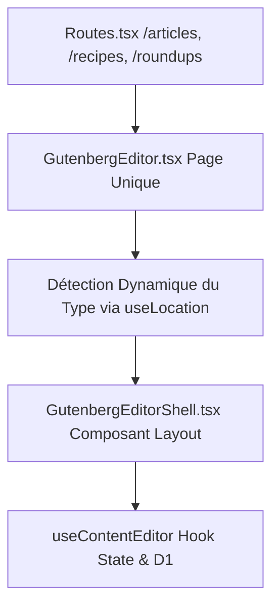

# Plan de Refactoring du Module BlockEditor (BlockNote) & Unification Absolue des Éditeurs Gutenberg

Ce document décrit le plan de refactoring d'architecture pour fusionner les trois éditeurs d'administration (`GutenbergArticleEditor.tsx`, `GutenbergRecipeEditor.tsx` et `GutenbergRoundupEditor.tsx`) en **une unique page d'édition dynamique unifiée** : `GutenbergEditor.tsx`.

L'objectif est d'atteindre un niveau de DRY (Don't Repeat Yourself) de 100%, d'optimiser le typage TypeScript strict, et de garantir une adhésion parfaite aux contrats du projet (`CONTENT_BLOCKS_CONTRACT.md`, `NAMING_CONTRACT.md` et `CONTENT_JSON_CONTRACT.md`).

---

## Problématique et Contexte

Actuellement, l'architecture d'édition présente plusieurs défis majeurs :
1. **Duplication Massive (3 Fichiers de Page redondants)** : Les éditeurs d'articles, de recettes et de roundups partagent près de 85% de leur structure. Garder 3 fichiers de page distincts est inutile puisque le hook `useContentEditor` et le BlockNote `schema` sont déjà génériques.
2. **Prop-Drilling des Canvas Handlers** : Le hook `useGutenbergCanvasHandlers` est instancié au niveau de la page et transmet plus de 10 propriétés et fonctions de manipulation de blocs, ce qui alourdit l'arbre React.
3. **Faiblesses de typage (`any` et `unknown`)** : Le hook `useContentEditor.ts` utilise des interfaces artisanales et des transtypages `unknown`, affaiblissant la sécurité du code en mode strict TypeScript 6.
4. **Performance de Saisie (Anti-Écho synchrone)** : La validation Zod et la sérialisation synchrone à chaque frappe clavier peuvent introduire des micro-lags sur les longs articles.

---

## La Solution : Unification Absolue (Un Seul Éditeur)

Plutôt que de garder 3 éditeurs distincts faisant appel à un shell commun, nous allons créer **une seule page d'édition universelle** : `GutenbergEditor.tsx`.



### Comment l'Éditeur Unique Identifie le Type de Contenu ?
Le composant unifié `GutenbergEditor.tsx` lira le segment de l'URL courante via `useLocation` pour déduire dynamiquement le type de contenu et configurer le shell :
```typescript
const { pathname } = useLocation();

let contentType: 'article' | 'recipe' | 'roundup' = 'article';
let backPath = '/articles';
let titleLabel = 'Article';

if (pathname.startsWith('/recipes')) {
    contentType = 'recipe';
    backPath = '/recipes';
    titleLabel = 'Recipe';
} else if (pathname.startsWith('/roundups')) {
    contentType = 'roundup';
    backPath = '/roundups';
    titleLabel = 'Roundup';
}
```

---

## Proposed Changes

Le plan est structuré en 6 phases logiques.

### 1. Typage TypeScript & Schéma Strict

Sécurisation de la définition de l'éditeur et élimination du type `any` au profit d'un type générique extrait du schéma BlockNote.

#### [MODIFY] [schema.ts](file:///c:/Users/Poste/Desktop/SaaS%20Astro/freecipies-blog/src/admin/components/BlockEditor/schema.ts)
*   Typage strict de `AppEditor` en exploitant les génériques de `BlockNoteEditor` basés sur le schéma généré.
*   Retrait de `any` dans `BlockNoteEditor<any>`.

#### [MODIFY] [editor.types.ts](file:///c:/Users/Poste/Desktop/SaaS%20Astro/freecipies-blog/src/admin/components/BlockEditor/types/editor.types.ts)
*   Amélioration de la définition de `AppBlock` pour correspondre plus précisément au type de bloc BlockNote tout en restant compatible avec l'interface d'adaptation.

---

### 2. Consolidation des Adapters de Blocs

Sécuriser le flux de conversion bidirectionnelle en renforçant les types d'entrée et de sortie au sein de chaque adaptateur individuel.

#### [MODIFY] [BlockAdapter.ts](file:///c:/Users/Poste/Desktop/SaaS%20Astro/freecipies-blog/src/admin/components/BlockEditor/blocks/BlockAdapter.ts)
*   Améliorer la signature de l'interface `BlockAdapter` pour inclure des types stricts pour les propriétés de l'éditeur (au lieu de `Record<string, unknown>`).
*   Ajouter une étape de validation formelle dans le registre des adapters.

#### [MODIFY] [Adapters de Blocs](file:///c:/Users/Poste/Desktop/SaaS%20Astro/freecipies-blog/src/admin/components/BlockEditor/blocks/adapters/)
*   **ParagraphAdapter.ts** / **HeadingAdapter.ts** / **AlertAdapter.ts** / **ImageAdapter.ts** / **FAQAdapter.ts** / **RelatedContentAdapter.ts** / **TableAdapter.ts** / **BeforeAfterAdapter.ts** / **RoundupListAdapter.ts** :
    *   Renforcer le typage TypeScript de `toEditor` et `fromEditor`.
    *   S'assurer que toutes les propriétés en base sont mappées en `snake_case` et toutes les variables TS en `camelCase`.
    *   Vérifier que les schémas Zod associés à chaque bloc sont sollicités lors de la phase `fromEditor` pour garantir l'adéquation au schéma avant l'export vers `content_json`.

---

### 3. Robustesse du Gestionnaire d'État & Algorithme Anti-Écho Débouncé

Optimisation des performances et de la fiabilité des mises à jour d'état pour éviter les re-renders inutiles lors de la saisie.

#### [MODIFY] [useEditorStateManager.ts](file:///c:/Users/Poste/Desktop/SaaS%20Astro/freecipies-blog/src/admin/components/BlockEditor/hooks/useEditorStateManager.ts)
*   Éliminer les transtypages `as any` ou `Record<string, unknown>` sur l'objet `editor`.
*   Utiliser les types d'API réels de BlockNote pour l'écoute des changements de contenu.
*   **Amélioration Performance** : Intégrer un système de debounce léger (ex: 300ms) pour la validation Zod complète de `ContentDocumentSchema` et l'émission du payload sérialisé au hook parent, évitant de bloquer le thread principal.

---

### 4. Validation des Données de FAQs et Roundup

S'assurer que les données annexes modifiées dans l'éditeur (ex: RoundupList et FAQSection) sont synchronisées sans effet de bord et stockées dans leurs colonnes dédiées respectives.

#### [MODIFY] [FAQSectionBlock.tsx](file:///c:/Users/Poste/Desktop/SaaS%20Astro/freecipies-blog/src/admin/components/BlockEditor/blocks/FAQSectionBlock.tsx)
*   Ajouter des types stricts pour les arguments de fonction (notamment les props de `SortableFAQItem` et `parseItems`).
*   S'assurer de la stricte conformité de la structure d'élément FAQ (`question` / `answer` au lieu des anciennes clés obsolètes `q` / `a`).

#### [MODIFY] [RoundupListBlock.tsx](file:///c:/Users/Poste/Desktop/SaaS%20Astro/freecipies-blog/src/admin/components/BlockEditor/blocks/RoundupListBlock.tsx)
*   Typage strict des données de listicle de roundup.

---

### 5. Composant de Layout Gutenberg Unique

#### [NEW] [GutenbergEditorShell.tsx](file:///c:/Users/Poste/Desktop/SaaS%20Astro/freecipies-blog/src/admin/features/articles/pages/shared/GutenbergEditorShell.tsx)
Ce composant encapsule l'entièreté de la mise en page, du header, des volets latéraux, des dialogues, du chargement, de la sauvegarde et de l'orchestration des états.
*   **Props** :
    *   `contentType`: `'article' | 'recipe' | 'roundup'`
    *   `backPath`: `string`
    *   `titleLabel`: `string`
*   **Gestion des Événements** :
    *   Instanciation interne de `useGutenbergCanvasHandlers`. Plus aucun prop-drilling pour les fonctions structurelles !
    *   Gestion automatisée d'**AI Settings** (pour les recettes).
    *   Gestion de l'**Introduction** (pour les roundups).
    *   Dialogues de médias (`MediaDialog`) et de prévisualisation (`ArticlePreview`).

---

### 6. Page Unique Universelle & Routage

#### [NEW] [GutenbergEditor.tsx](file:///c:/Users/Poste/Desktop/SaaS%20Astro/freecipies-blog/src/admin/features/articles/pages/GutenbergEditor.tsx)
*   Ce fichier unique remplace les 3 pages d'édition.
*   Détermine dynamiquement `contentType`, `backPath` et `titleLabel` selon le chemin d'URL (via `useLocation()`).
*   Effectue le rendu de `<GutenbergEditorShell />`.

#### [DELETE] [GutenbergArticleEditor.tsx](file:///c:/Users/Poste/Desktop/SaaS%20Astro/freecipies-blog/src/admin/features/articles/pages/GutenbergArticleEditor.tsx)
*   Fichier supprimé (fusionné dans `GutenbergEditor.tsx`).

#### [DELETE] [GutenbergRecipeEditor.tsx](file:///c:/Users/Poste/Desktop/SaaS%20Astro/freecipies-blog/src/admin/features/articles/pages/GutenbergRecipeEditor.tsx)
*   Fichier supprimé (fusionné dans `GutenbergEditor.tsx`).

#### [DELETE] [GutenbergRoundupEditor.tsx](file:///c:/Users/Poste/Desktop/SaaS%20Astro/freecipies-blog/src/admin/features/articles/pages/GutenbergRoundupEditor.tsx)
*   Fichier supprimé (fusionné dans `GutenbergEditor.tsx`).

#### [MODIFY] [routes.tsx](file:///c:/Users/Poste/Desktop/SaaS%20Astro/freecipies-blog/src/admin/app/routes.tsx)
*   Mise à jour des routes d'édition pour pointer vers l'éditeur unique `GutenbergEditor` au lieu des trois fichiers supprimés :
    ```typescript
    {
      path: 'articles/new',
      Component: lazyPage(() => import('@admin/features/articles/pages/GutenbergEditor')),
    },
    {
      path: 'articles/:slug',
      Component: lazyPage(() => import('@admin/features/articles/pages/GutenbergEditor')),
    },
    {
      path: 'recipes/new',
      Component: lazyPage(() => import('@admin/features/articles/pages/GutenbergEditor')),
    },
    {
      path: 'recipes/:slug',
      Component: lazyPage(() => import('@admin/features/articles/pages/GutenbergEditor')),
    },
    {
      path: 'roundups/new',
      Component: lazyPage(() => import('@admin/features/articles/pages/GutenbergEditor')),
    },
    {
      path: 'roundups/:slug',
      Component: lazyPage(() => import('@admin/features/articles/pages/GutenbergEditor')),
    },
    ```

---

## Verification Plan

### Automated Tests
1.  **Exécuter les tests actuels de non-régression :**
    ```bash
    pnpm test src/admin/components/BlockEditor/blocks/adapters/__tests__/roundtrip.test.ts
    ```
2.  **Vérification stricte de typage global :**
    ```bash
    pnpm typecheck
    ```

### Manual Verification
1.  **Vérification des chemins dynamiques :**
    *   Naviguer sur `/articles/new` (Vérifier que le type est bien Article).
    *   Naviguer sur `/recipes/new` (Vérifier la présence de l'IA et de la section Recette).
    *   Naviguer sur `/roundups/new` (Vérifier la présence de la section Introduction).
    *   Vérifier le bon enregistrement et le chargement en base pour les 3 types de contenus.
